# Story: GSWHAC-000

## Acceptance Criteria

**As a user, I want to be able to see up to date career information about a software developer on the internet.**

---

_What's this about? At DevWell, we want our courses to mirror real-life development environments as closely as possible. In modern software development, many developers do something called 'Agile', which is a way of organising projects more efficiently._

_As part of Agile, developers often work on 'Stories' that represent some piece of work that has an impact on a user. Hence the 'As a user...' structure of the Story acceptance criteria._

_Our Stories are then split into 'Tasks' that are bits of technical work that move us towards completing the Story. Tasks have 'Subtasks' that have to be completed before that Task can be marked as 'DONE'._

_When all the Tasks are 'DONE', the Story is also 'DONE'._

_Each course is a Story. Each lesson is a Task. Each task can either be 'SELECTED FOR DEVELOPMENT', 'IN PROGRESS' or 'DONE'._

_Note: There are many ways to implement Agile. This is just one of them._

---

# Task: GSWHAC-003

## Subtasks

**Push your repo up to GitHub**

**Deploy your site on Netlify**

# Status: SELECTED FOR DEVELOPMENT

By the end of this lesson, you will have:

1. Uploaded your site onto GitHub.
2. Deployed your site onto Netlify.

Things to remember:

1. This is another lesson where we won't really be coding that much. Next lesson tho...
2. These are KEY SKILLS used in real development jobs. Especially GitHub.
3. Netlify is amazing.
4. Google/DuckDuckGo.

# Status: IN PROGRESS

Go to https://github.com/ and sign up

Create a repository called `myResume`

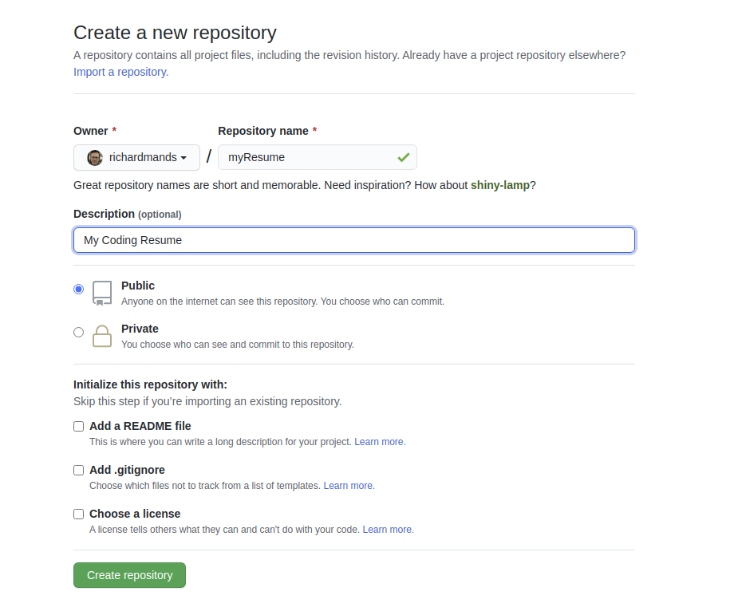

Copy the `HTTPS` git url

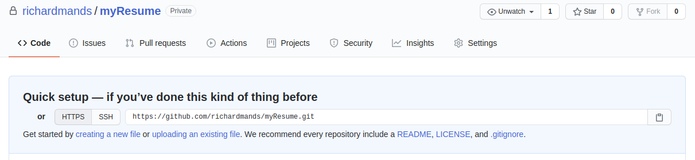

In the terminal, make sure you are in the `myResume` folder. If you're not, type `cd ~/_dev/myResume`

Type / paste `git remote add origin https://github.com/YOURGITHUBUSERNAME/myResume.git`. This will connect your local repo to the GitHub repo.

Type `git remote -v` and you will see your url listed.

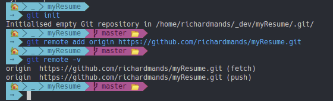

We want our computer to remember some of our git details.

Type, `git config --global user.name "username"` but change username to your GitHub username.

Then type, `git config --global user.email your@emailaddress.com` again with your GitHub email address.

Type `git config --global --list` and you should see your name and email address listed here.

Before we continue, there are some key terms that it would be great to have a handle on when it comes to git.

- 'repo' : the place where our project lives.

- 'commit' : basically deciding that this is code we want to keep. A commit is given a name so that we can look at the history of our commits and (hopefully, if it's a good name!) be able to understand what we did at a glance. This is different from saving. When you save your code, it is being saved locally. A commit makes a new version of the code inside git.

- 'diff' : the difference between your code in its different versions. E.g. between now and your previous commit. Or between any commit and any other commit. VSCode has great tools for seeing these diffs built in. Checking the diff is something you always want to do before making a commit.

- 'staged' : before we make a commit, we have to stage the code. This seems unnecessarily confusing. Because it is! But, you'll get used to it.

For context, this is my own process: look at the diff, decide that yes, this code is 'good', stage the code for that file, look at other files and repeat the process, when all the files I've changed have been staged, make a commit.

Let's go through the process of doing this now:

Click on the `Source Control` icon on the left in VSCode. You can think of this as the `git` icon. 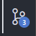

You'll notice that there are three files visible. That's because these are the files we've made but haven't 'committed' yet. If you click on them, you can see the 'diff'. In this case, the diff is really simple: nothing --> something.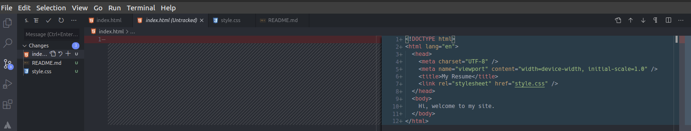

Click on `index.html` and check out the diff. If you are happy, click on the '+' icon to stage the changes for that file.

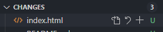.

Now we have three staged changes.

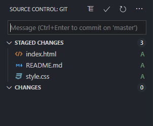

Write a commit message. It can be whatever you want but it should be something that has meaning in terms of what you were doing at the time. This is mine `index.html, style.css and README.md init`.

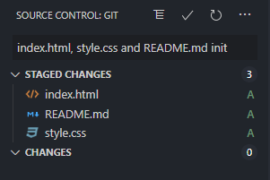

Then click on the checkmark to make the commit.

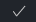

This is not the only way to make commits. You can do it all from the [command line](https://github.github.com/training-kit/downloads/github-git-cheat-sheet.pdf) if you want to.

Right, our code is now 'committed', so we are ready to 'push'.

I always like to do this from the command line, because it's clear what's happened and there's useful feedback in case anything goes wrong. Again, this is not the only way to do stuff, you can push from inside VSCode or use a GUI like [Sourcetree](https://www.sourcetreeapp.com/) or [GitKraken](https://www.gitkraken.com/).

- In the terminal, again, make sure you're in the correct folder (`cd ~/_dev/myResume`).
- Type, `git push origin master`. This will push your commit to the `origin` (your remote version of the repo ong GitHub) and to the branch called `master`. We'll talk more about what `branches` are when we have more than one.
- Use your GitHub login details to complete the push.
- Go to your repo on GitHub / refresh the page if you already have it open.

TADA!

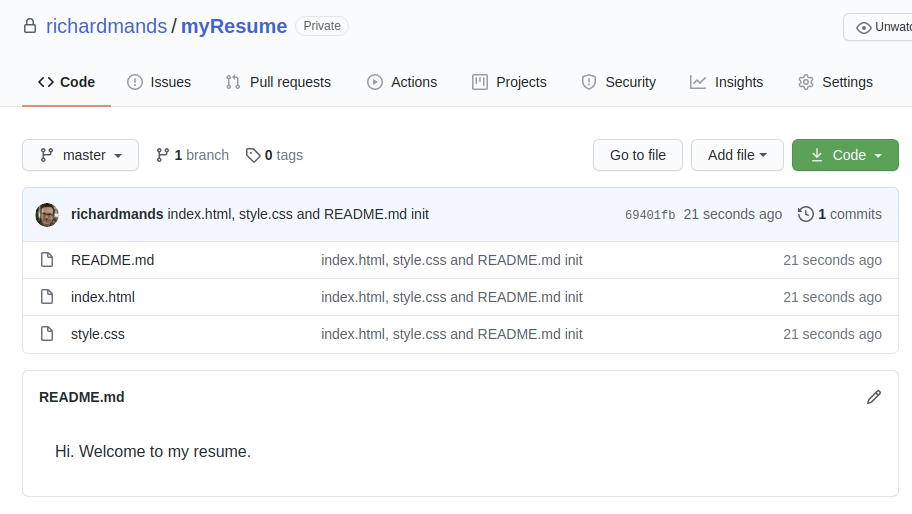

Finally, we are going to make our amazing site available for the whole world to see!

- Go to https://www.netlify.com/ and log in with your GitHub account details.
- Once you're in, click `New site from Git`
- Select `GitHub` then install Netlify on GitHub when prompted. When that's done, select `myResume` from the list.
- When that's done, choose `Deploy site`.

We are now deployed! But, we have a really lame url like https://upbeat-williams-7e6f71.netlify.app/ or something. Let's change that.

- Click on `Site settings` and then `Change site name`. Choose whatever tickles your fancy.

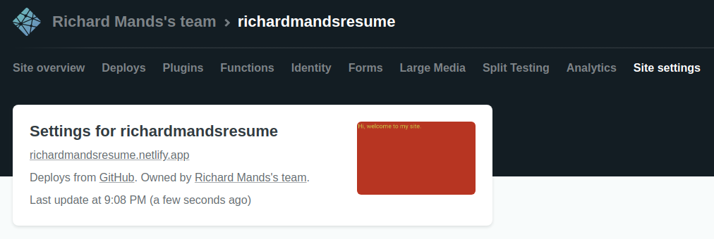.

And we're live!

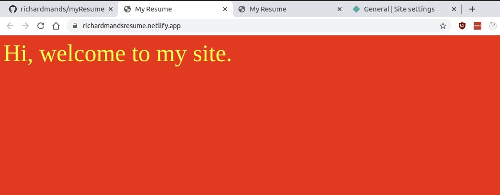

# Status: DONE

Awesome! Our code is now safely on GitHub and our site is now live on the internet. This is an amazing beginning and we'll soon have something that you'll be proud to show off to the world.

Onwards!

# Skills / Technologies

- Git
- Github
- Deployments
- Netlify

# Lesson Links

- https://git-scm.com/book/en/v2/Getting-Started-First-Time-Git-Setup
- https://github.com
- https://github.github.com/training-kit/downloads/github-git-cheat-sheet.pdf
- https://www.netlify.com/

# Course Links

## Editor / Terminal / Git

- https://code.visualstudio.com/
- https://www.techrepublic.com/article/16-terminal-commands-every-user-should-know/
- https://git-scm.com
- https://git-scm.com/book/en/v2/Getting-Started-First-Time-Git-Setup
- https://github.com
- https://github.github.com/training-kit/downloads/github-git-cheat-sheet.pdf
- https://www.netlify.com/
- https://github.com/adam-p/markdown-here/wiki/Markdown-Cheatsheet

## HTML / CSS

- https://www.w3schools.com/html/html_basic.asp
- https://www.w3schools.com/html/html_css.asp
- https://www.w3schools.com/html/html5_semantic_elements.asp
- https://fonts.google.com/specimen/Roboto?sidebar.open=true&selection.family=Roboto:wght@300;500
- https://www.rapidtables.com/web/css/css-color.html#white
- https://css-tricks.com/snippets/css/a-guide-to-flexbox/
- https://css-tricks.com/snippets/css/complete-guide-grid/
- https://www.w3schools.com/cssref/css3_pr_mediaquery.asp
