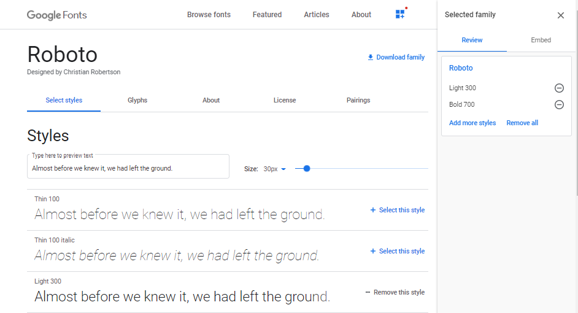

# Story: GSWHAC-000

## Acceptance Criteria

**As a user, I want to be able to see up to date career information about a software developer on the internet.**

---

_What's this about? At DevWell, we want our courses to mirror real-life development environments as closely as possible. In modern software development, many developers do something called 'Agile', which is a way of organising projects more efficiently._

_As part of Agile, developers often work on 'Stories' that represent some piece of work that has an impact on a user. Hence the 'As a user...' structure of the Story acceptance criteria._

_Our Stories are then split into 'Tasks' that are bits of technical work that move us towards completing the Story. Tasks have 'Subtasks' that have to be completed before that Task can be marked as 'DONE'._

_When all the Tasks are 'DONE', the Story is also 'DONE'._

_Each course is a Story. Each lesson is a Task. Each task can either be 'SELECTED FOR DEVELOPMENT', 'IN PROGRESS' or 'DONE'._

_Note: There are many ways to implement Agile. This is just one of them._

---

# Task: GSWHAC-004

## Subtasks

**Outline a basic webpage with a header, main and footer**

**Add some nice fonts**

**Update your code on GitHub**

**Expand your README to include more useful information**

# Status: SELECTED FOR DEVELOPMENT

There are two CSS 'technologies' that are core parts of being a modern front-end developer. They are 'Grid' and 'Flexbox'. In this lesson, we are going to make a start with Grid.

By the end of this lesson, you will have:

1. Added some nice fonts using Google Fonts.
2. Used CSS Grid to make the outline of the site.
3. Created a pull request on GitHub and merged your code.
4. Updated your README via Markdown with the technologies we have been learning and a Netlify status badge.

Things to remember:

1. Don't worry if things are confusing. Learn by doing, learn by doing, learn by doing...
2. Using Markdown to make engaging READMEs is super-fun
3. Google/DuckDuckGo.

# Status: IN PROGRESS

We are now going to start each lesson in the same way - making a new branch to work in. Once we're done with our code, we'll make a Pull Request and then merge our code into the master branch. This way, our master branch is always (in theory) ready to be deployed and be in a working state. If that's confusing, don't worry, it'll make more sense when we do it for real.

Click on the 'master' branch icon in VSCode


Then create a new branch called `GSWHAC-004`
You should see the icon update in VSCode.


Next, lets do something easy and fun. Go to https://fonts.google.com.

In the search, type in 'Roboto' and click on the first option.

That should bring you here: https://fonts.google.com/specimen/Roboto.

Now, we're going to generate some code that'll let us use this font in our 'myResume' project. Select 'Light 300' and 'Bold 700'



then click on 'Embed'.


Copy the `<link>` code and paste it into your `index.html` under CSS link.

Your `index.html` will now look like this:

```html
<!DOCTYPE html>
<html lang="en">
  <head>
    <meta charset="UTF-8" />
    <meta name="viewport" content="width=device-width, initial-scale=1.0" />
    <title>My Resume</title>
    <link rel="stylesheet" href="style.css" />
    <link
      href="https://fonts.googleapis.com/css2?family=Roboto:wght@300;700&display=swap"
      rel="stylesheet"
    />
  </head>
  <body>
    Hi, welcome to my site.
  </body>
</html>
```

Copy the CSS rule and paste it into the `body` in your `style.css` file. We'll also make a couple of other changes here.

```css
body {
  font-size: 16px;
  font-family: "Roboto", sans-serif;
  font-weight: 300;
}
```

We've set the base font size to something sensible and gotten rid of any silly colours.

Look at your site in a browser and it'll look like this:


We also got a 'bold' font from Google Fonts, so lets try that out.

In your `style.css` file, we are going to add a CSS 'class' called bold, that we can use whenever we want to make text bold.

We add classes by using a `.` in front of the name of the class we want to make. In this case `.bold`.

```css
body {
  font-size: 16px;
  font-family: "Roboto", sans-serif;
  font-weight: 300;
}

.bold {
  font-weight: 700;
}
```

In your `index.html` body, lets add the class to our text and see what happens.

```html
<!DOCTYPE html>
<html lang="en">
  <head>
    <meta charset="UTF-8" />
    <meta name="viewport" content="width=device-width, initial-scale=1.0" />
    <title>My Resume</title>
    <link rel="stylesheet" href="style.css" />
    <link
      href="https://fonts.googleapis.com/css2?family=Roboto:wght@300;700&display=swap"
      rel="stylesheet"
    />
  </head>
  <body class="bold">
    Hi, welcome to my site.
  </body>
</html>
```

We put `class="bold"` in our `<body>` tag and ...


That's our fonts sorted out. Let's make our page start to look like something.

Let's update our `index.html` body so it looks something like this:

```html
<body>
  <header>
    <p>A Simple HTML and CSS CV</p>
  </header>

  <main>
    <p class="bold">CV to appear here</p>
  </main>

  <footer>
    <p>This site was made by Richard Mands</p>
  </footer>
</body>
```

Result:


What we've done here is start so use some html [tags](https://www.w3schools.com/tags/ref_byfunc.asp).

The `header`, `main` and `footer` tags are defining different sections of our page.

The `p` tag defines a paragraph.

As much as possible, we want to use tags that are descriptive. This is called '[Semantic HTML](https://www.semrush.com/blog/semantic-html5-guide/)'. Effective use of Semantic HTML will make your code easier to read, and also help to optimise it for search engines ('SEO') and for disabled users ('Accessibility').

We could actually make the same thing with the following code:

```html
<body>
  <div>
    <div>A Simple HTML and CSS CV</div>
  </div>

  <div>
    <div class="bold">CV to appear here</div>
  </div>

  <div>
    <div>This site was made by Richard Mands</div>
  </div>
</body>
```

This will work, but it'll be much harder to understand in the future, as well as losing the other benefits of SEO/Accessibility.

This still doesn't look like a webpage though. Let's add some background colours to help see what's going on.

`style.css`

```css
body {
  font-size: 16px;
  font-family: "Roboto", sans-serif;
  font-weight: 300;
}

.bold {
  font-weight: 700;
}

header {
  background-color: pink;
}

main {
  background-color: greenyellow;
}

footer {
  background-color: aquamarine;
}
```


Still not great...

Let's use Grid to do some magic.

`index.html` body

```html
<body>
  <div class="gridContainer">
    <header>
      <p>A Simple HTML and CSS CV</p>
    </header>

    <main>
      <p class="bold">CV to appear here</p>
    </main>

    <footer>
      <p>This site was made by Richard Mands</p>
    </footer>
  </div>
</body>
```

`style.css`

```css
body {
  font-size: 16px;
  font-family: "Roboto", sans-serif;
  font-weight: 300;
}

.bold {
  font-weight: 700;
}

.gridContainer {
  min-height: 100%;
  display: grid;
  grid-template-rows: auto 1fr auto;
  grid-template-columns: 100%;
}

header {
  background-color: pink;
}

main {
  background-color: greenyellow;
}

footer {
  background-color: aquamarine;
}
```


Interesting...
So what we've done here is wrap our sections in a `div` with a `class=gridContainer`. That class uses the magic words `display: grid;` to turn on the Grid functionality (`display: flex;` does the same for Flexbox).

We then define some rows and some columns. We don't actually need any columns so can just set there to be one column with `100%` width - `grid-template-columns: 100%;`.

`grid-template-rows: auto 1fr auto;` means there will be three rows. The first and third rows will set their heights automatically to fit the content - `auto`. The second row will fill up the rest of the available space - `1fr`.

So why isn't that working if you look at the browser? We need to make one more change.

`style.css`

```css
html,
body {
  height: 100%;
  font-size: 16px;
  font-family: "Roboto", sans-serif;
  font-weight: 300;
}

.bold {
  font-weight: 700;
}

.gridContainer {
  min-height: 100%;
  display: grid;
  grid-template-rows: auto 1fr auto;
  grid-template-columns: 100%;
}

header {
  background-color: pink;
}

main {
  background-color: greenyellow;
}

footer {
  background-color: aquamarine;
}
```

This bit ...

```css
html,
body {
  height: 100%;
  font-size: 16px;
  font-family: "Roboto", sans-serif;
  font-weight: 300;
}
```

... means that both the html document itself, and body of the document take up 100% of the available space, instead of just growing to fit the content as it was before. That means our `1rf` on the `main` tag causes the `main` to grow to fill up all of the additional space. We now have the layout we want, with a header at the top and a footer at the bottom.

We've go one more problem though. There's an annoying white border around everything that's making the scrollbar appear unnecessarily.


We'll fix this by adding `margin: 0'` to our `body` CSS.
`style.css`

```css
html,
body {
  height: 100%;
  margin: 0;
  font-size: 16px;
  font-family: "Roboto", sans-serif;
  font-weight: 300;
}

.bold {
  font-weight: 700;
}

.gridContainer {
  min-height: 100%;
  display: grid;
  grid-template-rows: auto 1fr auto;
  grid-template-columns: 100%;
}

header {
  background-color: pink;
}

main {
  background-color: greenyellow;
}

footer {
  background-color: aquamarine;
}
```


Phew! We now have our final layout in place to start building the site properly!

We are nearly done.

Before we move on to the next lesson, I want to update our `README.md` so that it is more meaningful.

`README.md`

```md
# Hi. Welcome to my resume.

## Technologies used while building this site:

- HTML
- Semantic HTML
- CSS
- CSS Grid
- Google Fonts
- Git
- GitHub
- Netlify

## [See it live](https://richardmandsresume.netlify.app/)
```

Make sure you put the address of your own site though!

To see what it looks like for real, right click on the `README.md` tab and choose `Open Preview` in VSCode.

.

I've used [this guide](https://github.com/adam-p/markdown-here/wiki/Markdown-Cheatsheet) many times when I forget about formatting / syntax.

Here, we've used hashes `#` to make headers and added some bullet points and a link.

There's one more thing we want to add to make our README amazing.

Go to [Netlify](https://docs.netlify.com/monitor-sites/status-badges/#add-status-badges) to see how to get the status badge for your deployed site. This will let you see in the readme whether your site is working or broken.

Paste it into your `README.md`

```md
# Hi. Welcome to my resume.

## Technologies used while building this site:

- HTML
- Semantic HTML
- CSS
- CSS Grid
- Google Fonts
- Git
- GitHub
- Netlify

## [See it live](https://richardmandsresume.netlify.app/)

[](https://app.netlify.com/sites/richardmandsresume/deploys)
```

.

We're ready to make our Pull Request now.

Click on the 'Git' icon in VSCode and take a look at the changes we've made in each file.
.

If you're happy with the changes, stage them.

Add a commit message. I like to include the ticket number and a brief description - `GSWHAC-004 CSS Grid and Markdown` so it'll be easy to understand what I was doing in the future.

Make the commit by clicking on the checkmark.

.

Push up your new branch by clicking on the 'Publish Changes' icon next to the branch name.

.

Or, you can use the terminal. Type `git push origin GSWHAC-004` and hit return. Make sure you're in the `myResume` folder for this to work.

Now, go to GitHub, and visit the `myResume` repo. You should see something like this:

.

Click on 'Compare and pull request'.
.

You can see that we're making a 'Pull Request' (don't worry about the name, it just means that I want to merge one branch into another branch), for merging our new branch `GSWHAC-004` into master.

Add a meaningful comment and hit 'Create pull request'.

Once that's done, you'll see Netlify do it's thing. Click on the 'deploy-preview' to see if you're code is working properly.

.

Something really useful here is the 'Files changed' tab. This is a chance for you to do a final review of your new code before merging.

If you find a mistake, go back to VSCode, make your new changes, commit and push. GitHub will update with any new commits you've pushed.

Another thing you can do here if you want, is show the Pull Request to someone else and ask them to review the code for you. We're not going to do Code Reviews in this course, but they are a vital part of being a professional developer.

Finally, once you're happy that the code is good to go, hit 'Merge pull request' and confirm. You can delete the branch.

Go to the main page for 'myResume' on GitHub, and you'll now see your updated `README.md` in all its glory, status badge and all.

.

Click on the link and you'll see your site has updated automatically once we merged our PR into master!

FIN

# Status: DONE

That was pretty epic... We got a load done and now"

## Skills / Technologies

- Semantic HTML
- CSS Classes
- CSS Grid
- Google Fonts
- Git
- Github
- Markdown

# Lesson Links

- https://www.w3schools.com/tags/ref_byfunc.asp
- https://www.semrush.com/blog/semantic-html5-guide/
- https://seekbrevity.com/semantic-markup-important-web-design/
- https://fonts.google.com/
- https://fonts.google.com/specimen/Roboto?sidebar.open=true&selection.family=Roboto:wght@300;500
- https://css-tricks.com/snippets/css/complete-guide-grid/
- https://www.markdownguide.org/cheat-sheet/
- https://github.com/adam-p/markdown-here/wiki/Markdown-Cheatsheet

# Course Links

## Editor / Terminal / Git

- https://code.visualstudio.com/
- https://git-scm.com
- https://git-scm.com/book/en/v2/Getting-Started-First-Time-Git-Setup
- https://github.github.com/training-kit/downloads/github-git-cheat-sheet.pdf
- https://www.techrepublic.com/article/16-terminal-commands-every-user-should-know/

## HTML / CSS

- https://www.w3schools.com/html/html_basic.asp
- https://www.w3schools.com/html/html_css.asp
- https://www.w3schools.com/html/html5_semantic_elements.asp
- https://www.semrush.com/blog/semantic-html5-guide/
- https://fonts.google.com/specimen/Roboto?sidebar.open=true&selection.family=Roboto:wght@300;500
- https://www.rapidtables.com/web/css/css-color.html#white
- https://css-tricks.com/snippets/css/a-guide-to-flexbox/
- https://css-tricks.com/snippets/css/complete-guide-grid/
- https://www.w3schools.com/cssref/css3_pr_mediaquery.asp
