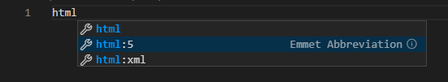
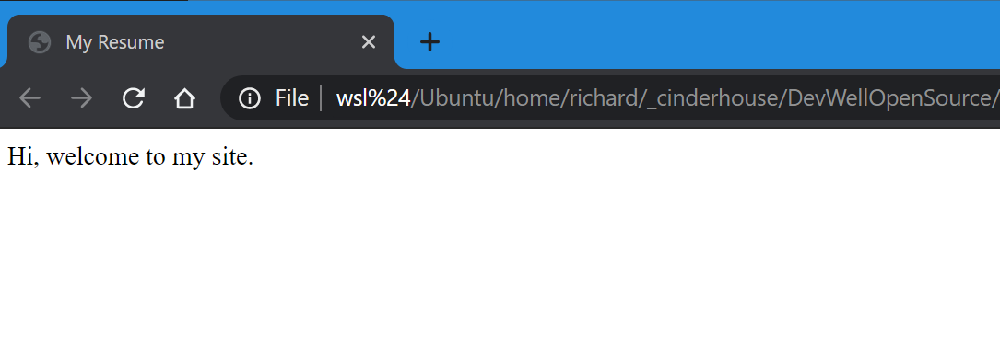
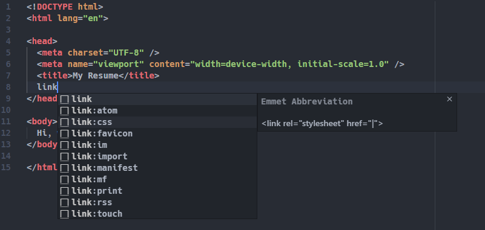
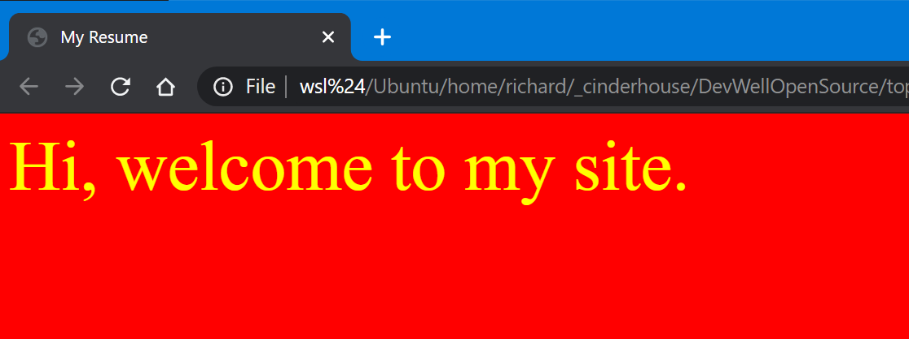

# Course Acceptance Criteria

_As a user, I want to be able to see up to date career information about a software developer._

---

# Lesson 1

Right! Hi. Welcome. So, in this course, we are going to use HTML and CSS to build a basic webpage that can act as a starting developers resume.

At this stage, everything is going to be very hand-holdy and basic. Don't worry though, it won't be like this for much longer...

By the end of this lesson, you will have:

1. Gotten to know the excellent code editor VSCode.
2. Created and styled a REALLY basic web page.

Things to remember:

1. This is just the beginning...
2. If you're stuck, Google it. Or DuckDuckGo it. Googling is absolutely a key skill for a developer.
3. Don't worry about first principles. You will learn by doing.

# Let's get started

- Install VSCode - https://code.visualstudio.com/
- Create a folder (on your Desktop is probably the easiest place to put it) called `myResume`
- Open `myResume` in VSCode
- Create a file called index.html
- Inside that file, type `html` and you'll see a magic box appear. Select the option `html:5`
  
- Your code should now look like this:

```html
<!DOCTYPE html>
<html lang="en">
  <head>
    <meta charset="UTF-8" />
    <meta name="viewport" content="width=device-width, initial-scale=1.0" />
    <title>Document</title>
  </head>
  <body></body>
</html>
```

If not, just copy and paste this into the file.

- Change the title to `My Resume`
- Inside the `body` type `Hi, welcome to my site.`

```html
<!DOCTYPE html>
<html lang="en">
  <head>
    <meta charset="UTF-8" />
    <meta name="viewport" content="width=device-width, initial-scale=1.0" />
    <title>My Resume</title>
  </head>
  <body>
    Hi, welcome to my site.
  </body>
</html>
```

- Save the file.
- Navigate to the index.html file in the folder on your Desktop.
- Open the file in your browser
- BEHOLD!
  
- Okay, that's not VERY exciting...
- Notice that tab title matches your HTML title <br/>

## Now to add some styles

- Create a file in the same folder called `style.css`
- In `index.html` underneath the `<title>`, type `link` and choose the magic `css` option.
  

```html
<!DOCTYPE html>
<html lang="en">
  <head>
    <meta charset="UTF-8" />
    <meta name="viewport" content="width=device-width, initial-scale=1.0" />
    <title>My Resume</title>
    <link rel="stylesheet" href="style.css" />
  </head>
  <body>
    Hi, welcome to my site.
  </body>
</html>
```

- Edit `style.css`

```css
body {
  color: yellow;
  background-color: red;
  font-size: 50px;
}
```

- refresh your browser window
- RE-BEHOLD!
  
- This color-scheme is both terrible and a tribute to the best ever [Windows Theme](https://www.google.com/search?biw=1718&bih=1359&tbm=isch&sa=1&ei=spocXvOBG9aD1fAPtviV8Ag&q=windows+hotdog&oq=windows+hotdog&gs_l=img.3..0i7i10i30j0i10i24l3.13242.13589..13951...0.0..1.148.381.4j1......0....1..gws-wiz-img.UQh0isAlTew&ved=0ahUKEwjzovW7_4DnAhXWQRUIHTZ8BY4Q4dUDCAc&uact=5)
- At this point, have a play with different colours and sizes until you find something you like.
- And, we're done!

# Review

Well done! You have welcomed people to your new site. Well, nearly... People can't actually see it yet... But, we'll get to that soon.

## Skills / Technologies

- HTML
- CSS
- Code Editors

# Course Links

## Editor / Terminal / Git

- https://code.visualstudio.com/
- https://git-scm.com
- https://git-scm.com/book/en/v2/Getting-Started-First-Time-Git-Setup
- https://github.github.com/training-kit/downloads/github-git-cheat-sheet.pdf
- https://www.techrepublic.com/article/16-terminal-commands-every-user-should-know/
- https://github.com/adam-p/markdown-here/wiki/Markdown-Cheatsheet

## HTML / CSS

- https://www.w3schools.com/html/html_basic.asp
- https://www.w3schools.com/html/html_css.asp
- https://www.w3schools.com/html/html5_semantic_elements.asp
- https://fonts.google.com/specimen/Roboto?sidebar.open=true&selection.family=Roboto:wght@300;500
- https://www.rapidtables.com/web/css/css-color.html#white
- https://css-tricks.com/snippets/css/a-guide-to-flexbox/
- https://css-tricks.com/snippets/css/complete-guide-grid/
- https://www.w3schools.com/cssref/css3_pr_mediaquery.asp
