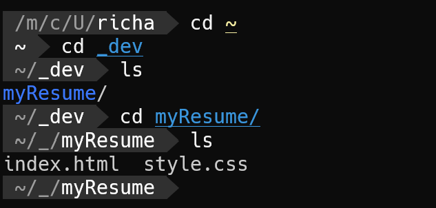
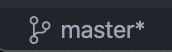

# Course Acceptance Criteria
*As a user, I want to be able to see up to date career information about a software developer.*

---
# Lesson 2

By the end of this lesson, you will have:

1. Used a terminal like a proper hacker.
2. Initialised a git repo and created your first `README.md`

Things to remember:

1. These are key skills used in real devlopment jobs.
2. Don't be afraid of the terminal. The terminal is awesome. You'll be using the same commands over and over so don't worry about remembering stuff. You'll get there.

3. Git is basically a way to save and manage your code. Actually, it's way more powerful than that, but that'll do for now...
4. As always, if you're stuck, Google it. Or DuckDuckGo it.

# Let's get started

- Open up a [terminal](https://www.google.com/search?newwindow=1&hl=en&sxsrf=ACYBGNQRsNnMfcaVap9TBdzlP5hVnZpXXw%3A1578955270617&source=hp&ei=BvIcXpXVI7CLlwT4lID4Cw&q=terminal+app+for&oq=terminal+app+for&gs_l=psy-ab.3..35i39j0i67j0l8.2879.5596..5985...2.0..0.97.1230.16......0....1..gws-wiz.....10..35i362i39j0i131i67j0i131j0i20i263.XzsMR5LwkkI&ved=0ahUKEwiV8JPg0oHnAhWwxYUKHXgKAL8Q4dUDCAg&uact=5) app such as Git Bash (part of [Git for Windows](https://gitforwindows.org/)) on Windows, Terminal or [iTerm2](https://iterm2.com/) on Mac. I'll leave linux users to sort this out themselves...
- Type `git --version`.
- You should see something like this: `git version 2.28.0`
- If you get an error, [download](https://git-scm.com/downloads) and install git. Try again until you see the version message (you may have to restart your computer, or at least reopen your terminal after the installation).

Now we have our terminal set up. Next, we are going to use the terminal to create a new place to keep our dev work.
- In the terminal type `cd ~` and hit enter. This will always take you to your 'user' directory.
- Type `mkdir _dev` and hit enter. You are making a folder called `_dev`. It DOES NOT have to be called that. But I always make one called that. The underscore helps it to look like something I've created myself. I like it. So there.
- Type `ls` and hit enter. You will see a list of folders and files in your 'user' folder.
- Type `cd _dev` and hit enter. You have now moved inside the `_dev` folder.
- Type `ls` and hit enter. There shouldn't be anything there.

We've now had a little play with some terminal commands. (I'm going to stop saying 'and hit enter' now) Next, we are going to move the folder we created in lesson one, into our `_dev` folder.
- Still inside your `_dev` folder in the terminal, open your file explorer by typing `open .` or `explorer.exe .` The `.` means 'this folder'.
- In another window, locate `myResume` and drag it into your `_dev` folder.
- In your terminal, type `ls` and you should now see `myResume` listed there.
- Type `cd my` then hit 'tab'. You should see the text autocomplete to `cd myResume`.
- Type `code .` and the folder should open up inside VSCode. On a Mac, you may need to do [this](https://code.visualstudio.com/docs/setup/mac#_launching-from-the-command-line) first.
- If that doesn't work, just open the folder from inside VSCode itself.

Right, so we've done a little bit more terminal fanciness and put our folders where we want them. The next thing we are going to do is to make our folder into a Git repository. That will allow us to easily (lol!) manage our code.
- In the terminal, we should be inside our `myResume` folder.
- Type, `git init`. You should see a message saying the repository has been initialized. In VSCode, at the bottom left, you should see a little logo and the word `master`. This means we are on the 'master' branch of our repo. This will all make sense eventually!

.

Finally, because we haven't written any code in this lesson...
- In VSCode, make a new file called `README.md` . The `.md` stands for 'markdown' and is a nice way to write texty stuff. In fact, I'm writing this lesson out right now in markdown. Well, not right now. In the past. You know what I mean...
- In the README, put a nice welcome message. This is mine: `Hi. Welcome to my resume.` The README is a key part of any repo and we'll be making great use of it throughout the course.

# Review

That's it! Phew... That was a tough one. But totally worth it. You can be a developer without using a terminal. It can totally be done. But, as you can see, they aren't that scary. As a professional developer, I use the terminal alongside the code editor on a daily basis.

## Skills / Technologies

- Terminal / Command Line
- Git
- Markdown

# Course Links

## Editor / Terminal / Git
- https://code.visualstudio.com/
- https://git-scm.com
- https://www.techrepublic.com/article/16-terminal-commands-every-user-should-know/
- https://github.com/adam-p/markdown-here/wiki/Markdown-Cheatsheet

## HTML / CSS
- https://www.w3schools.com/html/html_basic.asp
- https://www.w3schools.com/html/html_css.asp
- https://www.w3schools.com/html/html5_semantic_elements.asp
- https://fonts.google.com/specimen/Roboto?sidebar.open=true&selection.family=Roboto:wght@300;500
- https://www.rapidtables.com/web/css/css-color.html#white
- https://css-tricks.com/snippets/css/a-guide-to-flexbox/
- https://css-tricks.com/snippets/css/complete-guide-grid/
- https://www.w3schools.com/cssref/css3_pr_mediaquery.asp