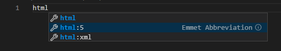
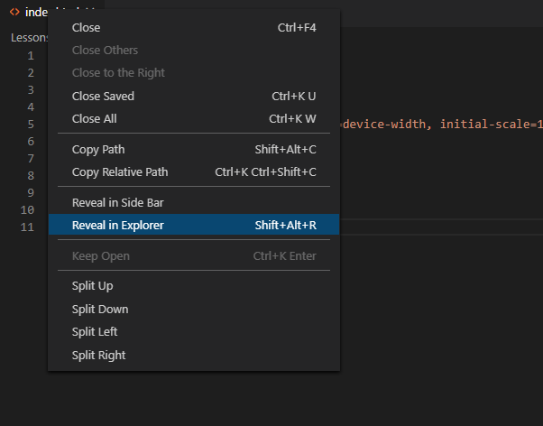
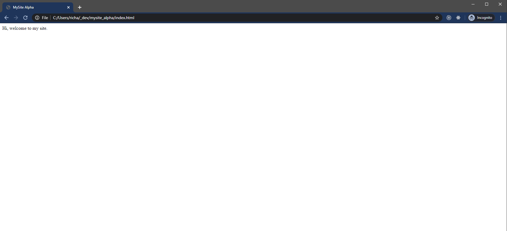
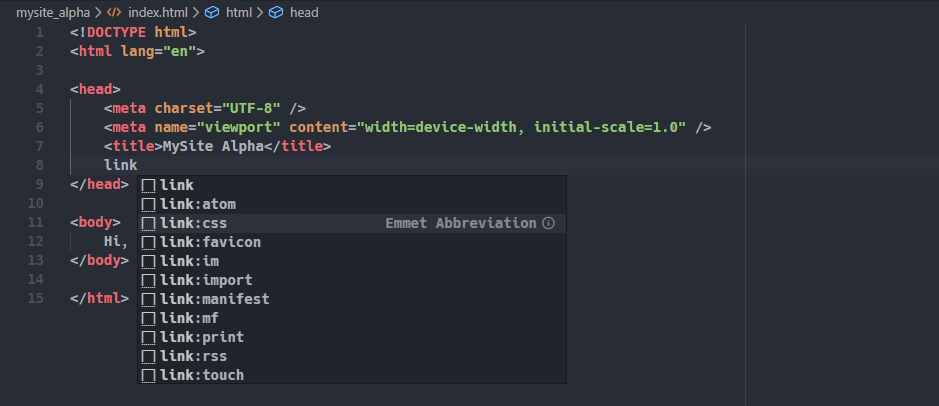
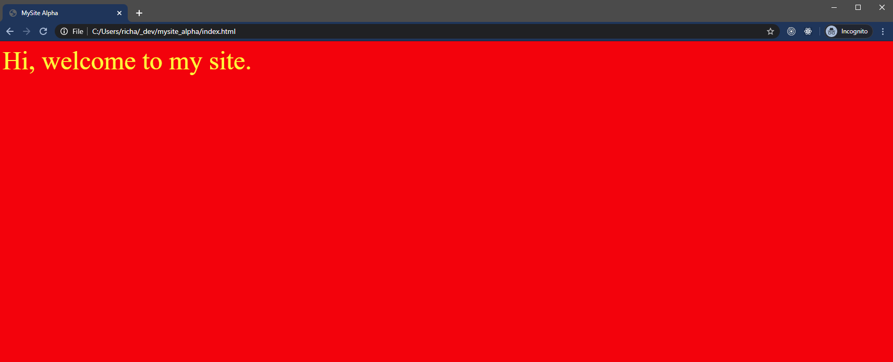

# Lesson 1 - Start Trek

Right! Hi. Welcome. So, you are about do something that we have gone through ourselves. That is, take the first small step into the world of software development.

At this stage, everything is going to be very hand-holdy and basic. Don't worry though, it won't be like this for much longer...

By the end of this lesson, you will have:

1. Gotten to know the excellent code editor VSCode.
2. Created and styled a REALLY basic web page.

Things to remember:

1. This is just the beginning...
2. If you're stuck, Google it. Or DuckDuckGo it. Googling is absolutely a key skill for a developer.
3. Some of what follows may seem like sneaky shortcuts. Well those sneaky shortcuts are what professional developers (like us!) use on a daily basis. There's no shame in it. Some people will suggest typing out all of the html code yourself until you understand the 'first principles'. I disagree. Shortcuts are amazing and 'first principles' in coding are never actually 'first'. This is a practical course, focussed on giving you the ability to actually 'do stuff'. Stuff that someone will be willing to pay you for. You will learn quickest by doing. And then doing again. And again. It is known...

# Let's get started

- Install VSCode - https://code.visualstudio.com/
- Create a folder called `mysite_alpha`
- Open `mysite_alpha` in VSCode
- Create a file called index.html
- Type `html` and you'll see a magic box appear. Select the option `html:5`
  
- Your code should now look like this:

```html
<!DOCTYPE html>
<html lang="en">
  <head>
    <meta charset="UTF-8" />
    <meta name="viewport" content="width=device-width, initial-scale=1.0" />
    <title>Document</title>
  </head>
  <body></body>
</html>
```

- Change the title to `MySite Alpha`
- Inside the `body` type `Hi, welcome to my site.`

```html
<!DOCTYPE html>
<html lang="en">
  <head>
    <meta charset="UTF-8" />
    <meta name="viewport" content="width=device-width, initial-scale=1.0" />
    <title>MySite Alpha</title>
  </head>
  <body>
    Hi, welcome to my site.
  </body>
</html>
```

- Save the file. It's probably worth turning on [autosave](https://www.google.com/search?q=vscode+turn+on+autosave&oq=vscode+turn+on+autosave&aqs=chrome..69i57j0l5j69i60.4663j0j7&sourceid=chrome&ie=UTF-8) at this point.
- Open the file in explorer / finder (right-click on the index.html tab)
  
- Open the file in your browser
- BEHOLD!
  
- Okay, that's not VERY exciting...
- Notice that tab title matches your HTML title <br/>
  

## Now to add some styles

- Create a file in the same folder called `style.css`
- In `index.html` underneath the `<title>`, type `link` and choose the magic `css` option.
  

```html
<!DOCTYPE html>
<html lang="en">
  <head>
    <meta charset="UTF-8" />
    <meta name="viewport" content="width=device-width, initial-scale=1.0" />
    <title>MySite Alpha</title>
    <link rel="stylesheet" href="style.css" />
  </head>
  <body>
    Hi, welcome to my site.
  </body>
</html>
```

- Edit `style.css`

```css
body {
  color: yellow;
  background-color: red;
  font-size: 50px;
}
```

- refresh your browser window
- RE-BEHOLD!
  
- This color-scheme is both terrible and a tribute to the best ever [Windows Theme](https://www.google.com/search?biw=1718&bih=1359&tbm=isch&sa=1&ei=spocXvOBG9aD1fAPtviV8Ag&q=windows+hotdog&oq=windows+hotdog&gs_l=img.3..0i7i10i30j0i10i24l3.13242.13589..13951...0.0..1.148.381.4j1......0....1..gws-wiz-img.UQh0isAlTew&ved=0ahUKEwjzovW7_4DnAhXWQRUIHTZ8BY4Q4dUDCAc&uact=5)
- At this point, have a play with different colours and sizes until you find something you like.
- And, we're done!

# Review

Well done! You have welcomed people to your new site. Well, nearly... People can't actually see it yet... But, we'll get to that soon.

## Skills / Technologies

- HTML
- CSS
- Code Editors

# Links

- https://code.visualstudio.com/
- https://www.w3schools.com/html/html_basic.asp
- https://www.w3schools.com/html/html_css.asp