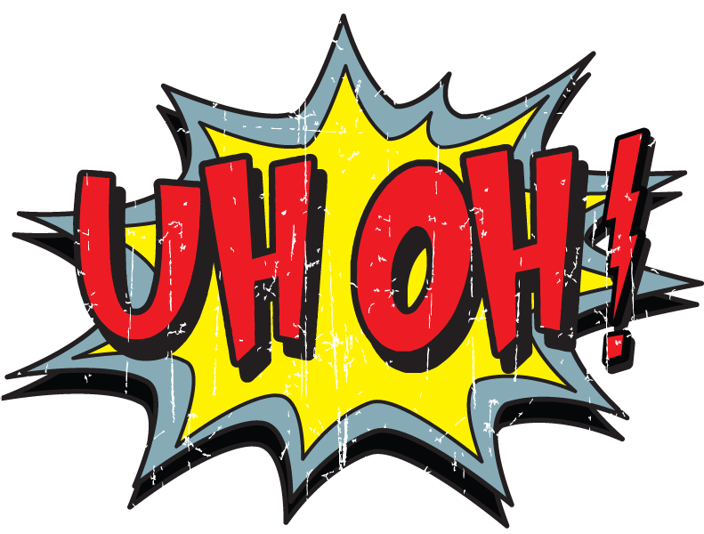

# This is a test Markdown File

- list item
- another list item

[A link of some kind](https://www.devwell.org)



### some code
```javascript
const horseman = 'horseman';
const bojack = `Bojack ${horseman} rulez`;
```
---

> This is a blockquote and will look like a reply of some kind.

> Neat!

